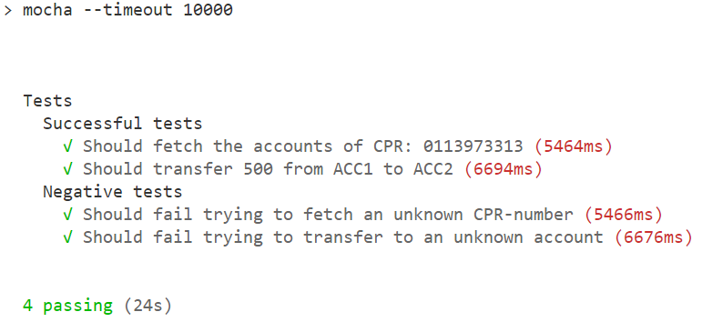

# Assignment 5 - Frontend Test
### The well-tested bank
___

### Group members:

- Adam Lass
- Rasmus Helsgaun
- Pernille Lørup

____ 

### Frontend Test 

In this assignment we were to create a simple front-end for our bank. We then had to create tests for a chosen browser in our preferred language using WebDriver. 

We made the decision to use Selenium Webdriver alongside with Mocha as a test framework. 

[Link to REST API / Backend](https://github.com/adamlass/test-bank)   
[Link to Test-code](https://github.com/adamlass/test-bank/blob/master/test/restTest.js)  

___


* To start the project run an ```npm install``` on both applications. 

For the backend you have to install firefox and geckodriver from [here](https://www.npmjs.com/package/selenium-webdriver) and have it in your PATH so that your Selenium can use it. 

* Then run an ```npm start``` on the backend and subsequently run the frontend and say ```'y'``` to running it on another port. From here you can run the test by running ```npm run test```  

* If you don't have time to run the project, you can see the results of the tests in the following screenshot or by reading the test code from [here](https://github.com/adamlass/test-bank/blob/master/test/restTest.js). There is also a desciption of the different tests below the image.  





**1) Should fetch the accounts of CPR: 0113973313:**  

* This test finds the input field by giving the webdriver the id. It then pastes a given CPR number and fetches the accountnumbers of the two returned accounts.  


**2) Should transfer 500 from ACC1 to ACC2:**   

* This test finds the input field by giving the webdriver the id. It then pastes a given CPR number and finds the transfer button on the first account by the element-id. From here it finds the account number input field and pastes a given account number. Then it finds the amount input field and clears it. The amount is now pasted in the input field and the transfer is submitted. The balance of each account is being compared before and after the transfer to make sure it was successful. 

**3) Should fail trying to fetch an unknown CPR-number:**  

* This test finds the input field by giving the webdriver the id. It then pastes a string with the same length as a CPR-number. Because the CPR-number is unknown an error message is shown. We then do a check on this error message to check that the error is what we expect.  

**4) Should fail trying to transfer to an unknown account:**  

* This test does the same as the transfer test above until an account number is being pasted. We enter an unknown number which will cause an error message. We do a check on this error message to check that the error is what we expect. 

